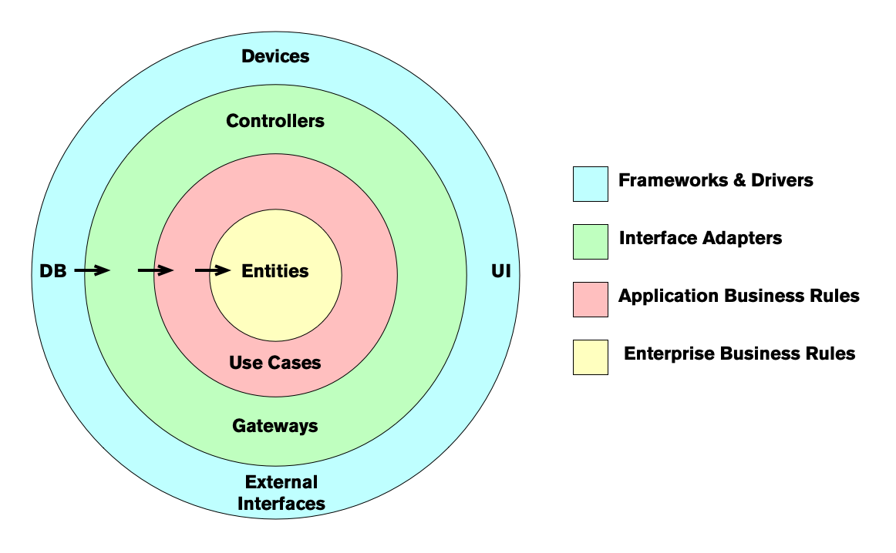

# Dependency Rule

When you are developing a software using the clean architecture you have different levels of abstraction, using the diagram the further you go the higher the level of abstraction. And the inner circles are the policies for the program.

> Source code dependencies must point only inwards, towards higher-level policies [^1]

This basically tell us that the outer circles are just implementation details of the program, the program itself should not rely on those circle but abstractions that represent those circles, the core of the program is in the inner circles which are the business logic.

Since this inner circle is the representation of the business rules, is less likely that this would required changes making them the most stable modules in the architecture.

## Entities

Entities are objects in our program that embodies a small set of critical rules for operating critical business data or has an easy way to access that data.

For example, in a banking application an entity could be a `Transaction`, an `Account`, a `Loan`, in social network application could be a `Post`, an `Article`, a `Story`.

This objects are concept that are use daily for the users of the program, it forces developer to focus more on the domain on which this program is going to run instead of a general ad-hoc implementation of a computational problem.

## Interactors

Interactors are another way to call _Use Cases_, and use cases contain the rules that specify how and when some critical business rules are applied when the entities are invoked. _Use Cases_ control the interaction between entities.

For example if are building an ATM software we have the use case `Withdraw Money` and for this operation we required different [Entities](#entities) like `Account`, `Transactions`, `User`.

The object `Account` have property like `balance` and with this information the _Use Case_ is able to decide if that particular `User` is able to `Withdraw Money` from that account and if it's possible then it would reduced that amount from the `Account`.

## Interface Adapters

The code that lives in the interface adapter layer is a set of adapters that convert data from the format most convenient for the use cases and entities, to the format most convenient for some external agent like a database or the web.

Example if we are working on a GUI for an android application the `MVC` model, the `Presenter`, `View` and `Controllers` all belong in this layer.

The same way for the database we transform the entities into a more convenient way to be stores in the persistent data layer, this means that if we are using SQL, [MongoDB](https://www.mongodb.com), [Redis](https://redis.io), [RethinkDB](https://rethinkdb.com) or plain files, those should be restricted to this layer and should not exist in neither the [Entities](#entities) or [Use Cases](#interactors) layer.

## Frameworks and Drivers

This is the outermost layer in the diagram and is composed of frameworks and tools, like databases or web frameworks. Usually you write glue code to interact with those services.

Every technology that is used beside the program itself is considered a detail.

[^1]: Robert C. Martin, 'The Clean Architecture Dependency Rule', _InformIT_, https://www.informit.com/articles/article.aspx?p=2832399
