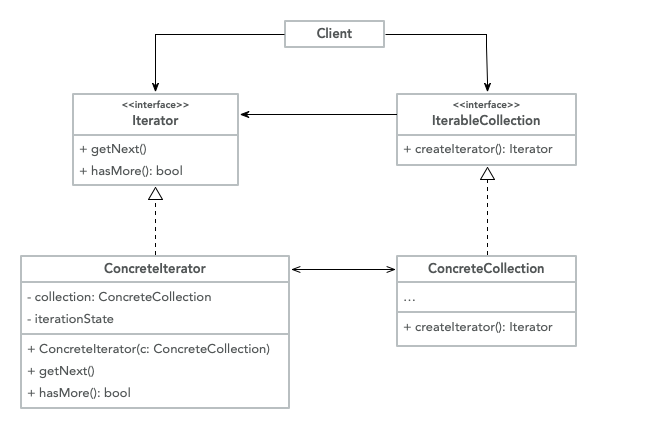

# Behavioral Design Patterns

> Behavioral patterns are concerned with algorithms and the assignment of
> responsibilities between objects.

## Iterator

It's a behavioral pattern that lets you traverse elements of a collection
without exposing the underlying representation.

**Explanation**

When we are working with objects that are related on another this are express
in terms of a
[Collection](<https://en.wikipedia.org/wiki/Collection_(abstract_data_type)>),
but this are generic by default, iterate over a collection is quite easy if
it's in the form of a list, but how about more complex structure like a tree,
we need to define a way on how to navigate or traverse this structure.

We would need to couple the traversal within the data structure and create
different implementation for each one, but the main reason for collection is
a storage of the data, to fix this we decouple the traversal of the data
structure into an iterator.

We could have a [Depth-first Iterator](https://www.geeksforgeeks.org/depth-first-search-or-dfs-for-a-graph/) or a [Breadth-first Iterator](https://www.geeksforgeeks.org/breadth-first-search-or-bfs-for-a-graph/) that handles
different types of traversal but the underlying data
structure, the [Tree](https://www.javatpoint.com/tree), is still the same.

**Structure**



- **Iterator**: This interface declares the operations (fetch next element,
  get current position, restart iteration, etc) that are required to traverse
  a collection.
- **Concrete Iterators**: Implements the specific algorithm for traversing
  the collection.
- **Collection**: This interface declares one or multiple methods for getting
  iterators compatible with the collection.
- **Concrete Collections**: Return new instances of a particular iterator
  class each time the client requests one.
- **Client**: Work with the collections and the iterators via their interfaces.

**Code**

```java
public class SQLRows<Type> implements Iterable<Type> {

	private Type[] arrayList;
	private int currentSize;

	public SQLRows(Type[] newArray) {
		this.arrayList = newArray;
		this.currentSize = arrayList.length;
	}

	@Override
	public Iterator<Type> iterator() {
		return new Iterator<Type>() {
			private int currentIndex = 0;

			@Override
			public boolean hasNext() {
				return currentIndex < currentSize
					&& arrayList[currentIndex] != null;
			}

			@Override
			public Type next() {
				return arrayList[currentIndex++];
			}

			@Override
			public void remove() {
				throw new UnsupportedOperationException();
			}
		};
	}
}
```

**When to use**

- When you have a complex data structure but want to hide the complexity
  from clients
- Reduce the duplication of traversal code across the app
- When you need your code to traverse different data structures or if you
  don't know the structure beforehand
