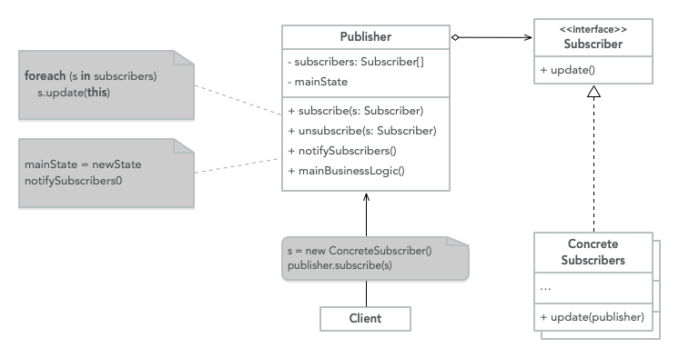

# Behavioral Design Patterns

> Behavioral patterns are concerned with algorithms and the assignment of
> responsibilities between objects.

## Iterator

It's a behavioral pattern that lets you traverse elements of a collection
without exposing the underlying representation.

**Explanation**

When we are working with objects that are related on another this are express
in terms of a
[Collection](<https://en.wikipedia.org/wiki/Collection_(abstract_data_type)>),
but this are generic by default, iterate over a collection is quite easy if
it's in the form of a list, but how about more complex structure like a tree,
we need to define a way on how to navigate or traverse this structure.

We would need to couple the traversal within the data structure and create
different implementation for each one, but the main reason for collection is
a storage of the data, to fix this we decouple the traversal of the data
structure into an iterator.

We could have a [Depth-first Iterator](https://www.geeksforgeeks.org/depth-first-search-or-dfs-for-a-graph/) or a [Breadth-first Iterator](https://www.geeksforgeeks.org/breadth-first-search-or-bfs-for-a-graph/) that handles
different types of traversal but the underlying data
structure, the [Tree](https://www.javatpoint.com/tree), is still the same.

**Structure**


- **Iterator**: This interface declares the operations (fetch next element,
  get current position, restart iteration, etc) that are required to traverse
  a collection.
- **Concrete Iterators**: Implements the specific algorithm for traversing
  the collection.
- **Collection**: This interface declares one or multiple methods for getting
  iterators compatible with the collection.
- **Concrete Collections**: Return new instances of a particular iterator
  class each time the client requests one.
- **Client**: Work with the collections and the iterators via their interfaces.

**Code**

```java
public class SQLRows<Type> implements Iterable<Type> {

	private Type[] arrayList;
	private int currentSize;

	public SQLRows(Type[] newArray) {
		this.arrayList = newArray;
		this.currentSize = arrayList.length;
	}

	@Override
	public Iterator<Type> iterator() {
		return new Iterator<Type>() {
			private int currentIndex = 0;

			@Override
			public boolean hasNext() {
				return currentIndex < currentSize
					&& arrayList[currentIndex] != null;
			}

			@Override
			public Type next() {
				return arrayList[currentIndex++];
			}

			@Override
			public void remove() {
				throw new UnsupportedOperationException();
			}
		};
	}
}
```

**When to use**

- When you have a complex data structure but want to hide the complexity
  from clients
- Reduce the duplication of traversal code across the app
- When you need your code to traverse different data structures or if you
  don't know the structure beforehand

## Observer

> Defines a subscription mechanism to notify multiple objects that events are
> happening to the object that they are observing.

**Explanation**

This pattern is an implementation of the
[Publish-Subscribe Pattern](https://ably.com/topic/pub-sub) at the code level,
when you have an object that wants to be notified (subscriber) when another
object changes its state (publisher), the first object creates a subscription
that the second object is going to notify when a particular change happens.

The reason for this is to avoid asking the target object all the time if its
state has changed, we can invert the logic and let the target object notify
all the objects that are interested in its state, when these changes happened,
and what is the new state.

The _target object_ is called a `Publisher` and the interesting object is
the `Subscriber`, you can have multiple `Subscribers` follow a single
`Publisher`. The publisher keeps track of all the `Subscribers` and lets them
know when a state changes, `Subscribers` can also request to be removed from
the `Subscriber` list.

One real-life implementation for this would be an
[Email Newsletter](https://www.campaignmonitor.com/resources/knowledge-base/what-is-an-email-newsletter/), in this analogy we
the users are the `Subscribers` and the Newsletter would be the `Publisher`,
as users we request to be added to the Newsletter and at the same time, we
can request to be unsubscribed from that Newsletter when we no longer have
any interested in them.

**Structure**



- **Publisher**: It creates events that are interesting to the other objects,
  this happens when an event happens or when the object performs some behavior.
  They contain a subscription infrastructure that let new subscribers join and
  current subscribers leave the list
- **Subscriber**: Interface that declares the notification interface. Usually
  consists of a method that has several parameters that let the publisher pass
  some events along with the update.

> When a new event happens the `Publisher` goes through the list of
> `Subscribers` and calls the notification method in the subscriber interface
> to let them know that a change happened

**Code**

```java
class Client {
	public static void main(String[] args) {
		Publisher publisher = new Publisher();
		EventSubscriber subscriber = new EventSubscriber();
		publisher.subscribe(subscriber);
	}
}

class Publisher {
	private Collection<Subscriber> subscribers;
	State state;

	Publisher() {
		this.subscribers = new HashSet<>();
	}

	void subscribe(Subscriber subscriber) {
		this.subscribers.add(subscriber)
	}

	void unsubscribe(Subscriber subscriber) {
		this.subscribers.remove(subscriber);
	}

	void notifySubscribers() {
		while (subscribers.hasNext()) {
			Subscriber subscriber = subscribers.next();
			subscriber.update(this)
		}
	}

	mainBusinessLogic() {
		// Something happens that changes the state
	}
}

class EventSubscriber implements Subscriber {
	update(Publisher publisher) {
		// I react to the state
		State state = publisher.state;
	}
}

interface Subscriber {
	update(Publisher publisher)
}

class State {}
```

**When to use**

- When you need an object to change when the state of another object changes
- When you need to observe some objects for a limited time or specific cases
