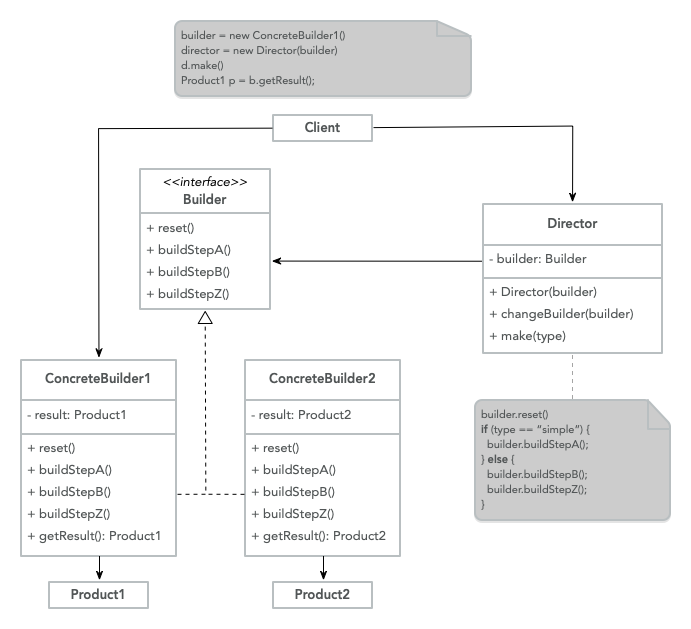

# Creational Design Patterns

Creational Design Patterns are patterns that provide multiple object creation
mechanisms, they achieve this by abstracting the instantiation process.

This enables systems to be flexible and independent on how the objects are
created, composed, or represented, they become important in a system evolution
where the systems rely more on object composition than inheritance, because
the approach stops relying on a hard-code fix behavior, instead it focuses
on the fundamental behavior that can be composed to create
more complex one. [^1]

## Factory Method

> Provides an interface to create an object in a
> superclass, but enable subclasses to modify the type of objects that will
> be created.

It separates the process of creating an object from the code that depends
on the interface of the object. [^2]

**Explanation**

When an application requires that you behave in a particular way to perform
a task, the concrete implementation is identified by some parameter.

Instead of using conditionals to determine the specific concrete type, you
delegate that decision to a separate component that creates said
object (`Factory`).

Using the pattern adds flexibility and scalability to the code because it
easily enables to add of more concrete behaviors over time without the
need to change the code, conforming with OCP.

**Structure**


- **Truck**: Is the interface that is common by all the objects that are
  generated by the `Creator` and its subclasses
- **Concrete truck**: Is the specific implementation of the
  interface
- **Creator**: Is the entry point for the factory method, and returns
  a `Truck` object, this is only an abstraction the actual creation
  doesn't happens in this class, this could be treated as a base class
  for a default behavior or an abstract class to force the
  `Concrete Creators` to implement the logic.
- **Concrete Creators**: Override the factory method to return a different
  type of `Truck`.

**Code**

```java
class Client {
  private Creator creator;
  private Truck truck;
  public static void main(String[] args) {
	  String truckType = args[0];
	  if(truckType === "fire") {
		  this.creator = new FireTruckCreator();
	  } else {
		  this.creator = new GarbageTruckCreator();
	  }
	  this.truck = this.creator.createTruck();
	  this.truck.move();
  }
}

class Creator {
  public abstract Truck createTruck();
  public void operation() {}
}

interface Truck {
  public void move();
}

class FireTruck implements Truck {
  public void move() {}
}

class GarbageTruck implements Truck {
  public void move() {}
}

class FireTruckCreator extends Creator {
  public Truck createTruck() {
	return new FireTruck()
  }
}

class GarbageTruckCreator extends Creator {
  public Truck createTruck() {
	  return new FireTruck()
  }
}
```

**When to use**

- When you don’t know beforehand how many types or dependencies your code
  rely on.
- When you want to provide users of your library or framework a way to
  extend it’s internal components.
- When you need to save system resources by reusing objects instead of
  rebuilding them each time.

## Builder

> Construct complex objects step by step.

It allows you to create different types and representations of an object
using the same construction code.

**Explanation**

When you are building an object that could have different parameters and
permutations you could potentially create subclasses to specify the behavior
and structure of an object, but this would be harder the maintain.

Another approach would be to use a giant constructor in the base class with
all the possible parameters to control the object, the issue with this, is
that you end up doing a lot of refactoring once a new requirement gets
introduced, and also makes the constructor call pretty ugly since in most
cases most of the parameters are not used.

> A simple constructor has a very small number of parameters, and all
> parameters are primitives or enums. Such simple constructors increase
> usability. [^3]

The `Builder` patterns suggest that we need to extract the object construction
of the code out of its own class and move it into separate objects
called `builders`.

This builder provides a set of functions that enables you to specify the
values that are required by the final object and has a function called
`build` that starts the building process and returns the required object.

You can find an example of the `Builder` pattern in Java `Calendar` Object.

```java
Calendar cal = new Calendar.Builder()
				   .setCalendarType("japanese")
				   .setFields(YEAR, 1, DAY_OF_YEAR, 1)
				   .build();
```

**Code**

```java
class Client {
	public static void main(String[] args) {
		ConcreteBuilder1 builder = new ConcreteBuilder1();

		Director director = new Director(builder);
		director.make();

		Product1 product = builder.getResult();

		// Change builder to create a different product
		ConcreteBuilder2 builder2 = new ConcreteBuilder2();
		director.changeBuilder(builder2)
		director.make()

		Product2 product2 = builder2.getResult();
	}
}

class Director {
	private Builder builder;
	public void Director(Builder builder) {
		this.builder = builder;
	}

	public void changeBuilder(Builder builder) {
		this.builder = builder;
	}

	public void make() {
		this.builder.reset();
		String type = this.builder.getType();
		if(type == "simple") {
			this.builder.buildStepA();
		} else {
			this.builder.buildStepB();
			this.builder.buildStepZ();
		}
	}
}

interface Builder {
	String getType();
	void reset();
	void buildStepA()
	void buildStepB()
	void buildStepZ()
}

class ConcreteBuilder1 implements Builder {
	private Product1 result;
	public String getType() {
		return "simple";
	}
	public void buildStepA() {}
	public void buildStepB() {}
	public void buildStepZ() {}
	public Product1 getResult() {
		return this.result;
	}
}

class ConcreteBuilder2 implements Builder {
	private Product2 result;
	public String getType() {
		return "complex";
	}
	public void buildStepA() {}
	public void buildStepB() {}
	public void buildStepZ() {}
	public Product2 getResult() {
		return this.result;
	}
}

class Product1 {}
class Product2 {}
```

**Structure**



- **Builder**: It's an interface that declares all the available steps that
  are common across all the different types of builders.
- **Concrete Builders**: Provides an implementation of different construction
  steps.
- **Products**: These are the end result objects which are produced by
  different builders.
- **Director**: It's the coordinator of the builders, it provides the order
  of the construction steps and can create and reuse specific configurations
  of products.
- **Client**: It must associate a builder object with a director, usually
  done once via the director constructor but depending on the use case it
  could have multiple builders for different steps or complex data structures.

**When to use**

- You require a lot of parameters or steps to create an object.
- You want to create a different representation of some object.
- When you need to construct a [Composite Tree](https://refactoring.guru/design-patterns/composite) or other complex data structures.

[^1]:
    'Creational Patterns', _The University of North Carolina at Chapel
    Hill_, https://www.cs.unc.edu/~stotts/GOF/hires/chap3fso.htm

[^2]:
    Isaac Rodriguez, 'The Factory Method Pattern and Its Implementation
    in Python', _Real Python_, https://realpython.com/factory-method-python/

[^3]:
    'Constructor Design', _Microsoft_, September 9, 2021,
    https://learn.microsoft.com/en-us/dotnet/standard/design-guidelines/constructor
