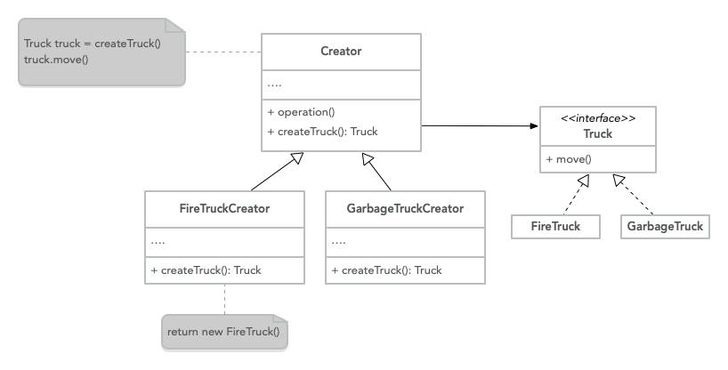

# Creational Design Patterns

Creational Design Patterns are patterns that provide multiple object creation
mechanisms, they achieve this by abstracting the instantiation process.

This enables systems to be flexible and independent on how the objects are
created, composed, or represented, they become important in a system evolution
where the systems rely more on object composition than inheritance, because
the approach stops relying on a hard-code fix behavior, instead it focuses
on the fundamental behavior that can be composed to create
more complex one. [^1]

## Factory Method

This is a design pattern that provides an interface to create an object in a
superclass, but enable subclasses to modify the type of objects that will
be created.

It separates the process of creating an object from the code that depends
on the interface of the object. [^2]

**Explanation**

When an application requires that you behave in a particular way to perform
a task, the concrete implementation is identified by some parameter.

Instead of using conditionals to determine the specific concrete type, you
delegate that decision to a separate component that creates said
object (`Factory`).

Using the pattern adds flexibility and scalability to the code because it
easily enables to add of more concrete behaviors over time without the
need to change the code, conforming with OCP.

**Structure**



- **Truck**: Is the interface that is common by all the objects that are
  generated by the `Creator` and its subclasses
- **Concrete truck**: Is the specific implementation of the
  interface
- **Creator**: Is the entry point for the factory method, and returns
  a `Truck` object, this is only an abstraction the actual creation
  doesn't happens in this class, this could be treated as a base class
  for a default behavior or an abstract class to force the
  `Concrete Creators` to implement the logic.
- **Concrete Creators**: Override the factory method to return a different
  type of `Truck`.

  **Code**

  ```java
  class Client {
    Creator creator;
    Truck truck;
    public static void main(String[] args) {
  	  String truckType = args[0];
  	  if(truckType === "fire") {
  		  this.creator = new FireTruckCreator();
  	  } else {
  		  this.creator = new GarbageTruckCreator();
  	  }
  	  this.truck = this.creator.createTruck();
  	  this.truck.move();
    }
  }

  class Creator {
    public abstract Truck createTruck();
    public void operation() {}
  }

  interface Truck {
    public void move();
  }

  class FireTruck implements Truck {
    public void move() {}
  }

  class GarbageTruck implements Truck {
    public void move() {}
  }

  class FireTruckCreator extends Creator {
    public Truck createTruck() {
  	return new FireTruck()
    }
  }

  class GarbageTruckCreator extends Creator {
    public Truck createTruck() {
  	  return new FireTruck()
  	}
  }
  ```

**When to use**

- When you don’t know beforehand how many types or dependencies your code
  rely on.
- When you want to provide users of your library or framework a way to
  extend it’s internal components.
- When you need to save system resources by reusing objects instead of
  rebuilding them each time.

[^1]:
    'Creational Patterns', _The University of North Carolina at Chapel
    Hill_, https://www.cs.unc.edu/~stotts/GOF/hires/chap3fso.htm

[^2]:
    Isaac Rodriguez, 'The Factory Method Pattern and Its Implementation
    in Python', _Real Python_, https://realpython.com/factory-method-python/
