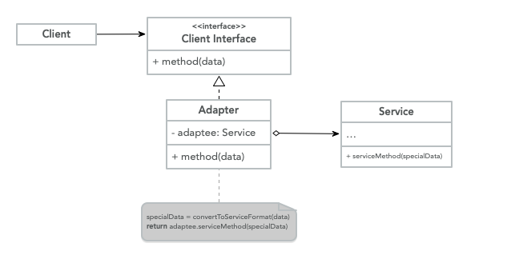
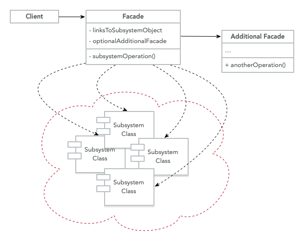

# Structural Design Patterns

These kinds of patterns explain how we can assemble objects and classes into
larger structures, while still keeping these structures flexible and efficient.

## Adapter

> It's a structural design pattern that allows objects with incompatible
> interfaces to collaborate.

**Explanation**

Sometimes we have data types that are incompatible with one another, for
example, we could have users purchase activity as `XML` files, we found a
third-party service that is able to give us a recommendation model for the
users but this service uses `JSON` format as the input data.

We use the adapter pattern to create an interface that translates the content
from `XML` to `JSON` objects that can then be used by the
recommendation engine.

Besides transforming from different data formats we can also use it to create
objects with different interfaces to collaborate.

**Structure**



- **Client**: This is a class that contains the business logic of the program.
- **Client Interface**: Describes the protocol that the other classes need to
  follow to interact with the client code.
- **Service**: This is the class that requires the data to be transformed,
  the `Client` can use the service directly because of the compatibility.
- **Adapter**: Is the class that can work with both the client and the service,
  and implements the `Client Interface` while wrapping the service object. The
  adapter receives calls from the client via the adapter interface and translates
  those requests to the service in a format that it can understand.

**Code**

```java
class Client {
	public static void main(String[] args) {
		String xmlFilePath = args[0];
		XML data = magicMethod(xmlFilePath);

		DataAdapter adapter = new DataAdapter();
		JSON json = adapter.transform(data);

		JsonService.serviceMethod(json)
	}
}

class DataAdapter implements DataTransformation {
	public JSON transform(XML xml) {
		JSON json = new JSON();
		// Magic happens
		json.data = xml.data;
		return json;
	}
}

interface DataTransformation {
	JSON transform(XML xml)
}

class XML {}

class JsonService {
	public static void serviceMethod(JSON json)
}

class JSON {}
```

**When to use**

- When you have an existing class but this class isn't compatible with the
  rest of the codebase.
- When you want to reuse existing subclasses that lack common functionality
  that can be abstracted into a superclass.

## Façade

> Is a structural design pattern that simplifies the interface to a library,
> a framework, or any complex set of classes.

**Explanation**

When we need to rely on frameworks or specific libraries, we need to
initialize, configure and keep track of dependencies and execute the method
in the correct order.

In the end, the logic of the application gets tightly coupled with the
implementation of this third-party library, which makes it hard to maintain
and comprehend, to avoid this we create a simple interface that provides the
functionality that we really cared about instead of worrying about the
underlying implementation.

This limits the functionalities provided by the library but enhances the
functionality that our business really required and also decouples the
program from that library.

**Structure**



- **Client**: Uses the `Façades` instead of calling the subsystems objects
  directly.
- **Façade**: It provides convenient access to a particular part of the
  subsystem functionality.
- **Additional Façade**: These façades can also be created to prevent
  polluting a single façade with an unrelated feature that would make it
  another complex structure, this façade can be used by the client or
  another façade.
- **Complex Subsystem**: It could be various objects that interact in
  complex ways, third-party libraries, frameworks, ORM. These subsystems are
  unaware of the existence of the `Façades`.

**Code**

```java
class Client {
	public static void main(String[] args) {
		Coordinate from = getCurrentLocation();
		Coordinate to = getFavoriteLocation("home");

		MapService service = new MapService();

		Direction[] directions = service.getRoute(from, to);
		Event[] events = service.getEvents(directions);

		// Read out loud directions
		speak(directions)

		// Read out loud any events in the route
		speak(events)
	}
}

class Coordinate {
	private Float latitude;
	private Float longitude;
	public void Coordinates(Float latitude, Float longitude) {
		this.latitude = latitude;
		this.longitude = longitude
	}
}

class MapService  {
	private GoogleMap googleMapService;
	private Waze wazeService;
	public void MapService() {
		this.googleMapService = new GoogleMap();
		this.wazeService = new Waze();
	}
	public Direction[] getRoute(Coordinate from, Coordinate to) {
		this.googleMapService.getRoute(from, to);
	}
	public Event[] getEvents(Direction[] directions) {
		return this.wazeService.getEvents(directions);
	}
}

class GoogleMap {
	public Direction[] getRoute(Coordinate from, Coordinate to) {}
}

class Waze {
	public Event[] getEvents(Direction[] directions) {}
}

class Direction {}
class Event {}
```

**When to use**

- When you need a simple interface to interact with a complex subsystem.
- When you want to structure the subsystem into layers.
- When you want to decouple a library or framework from the business logic.
