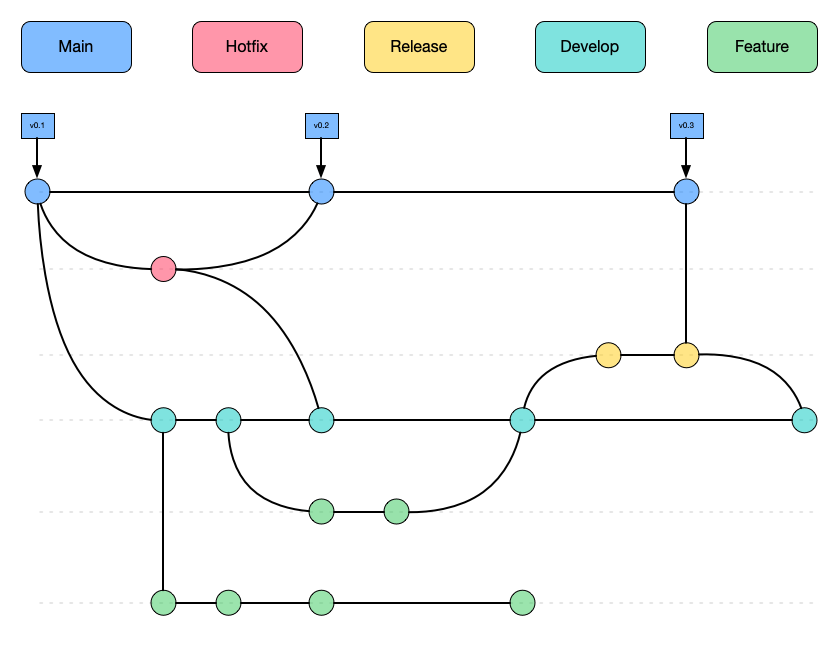
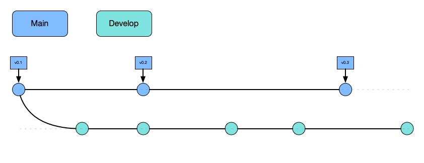
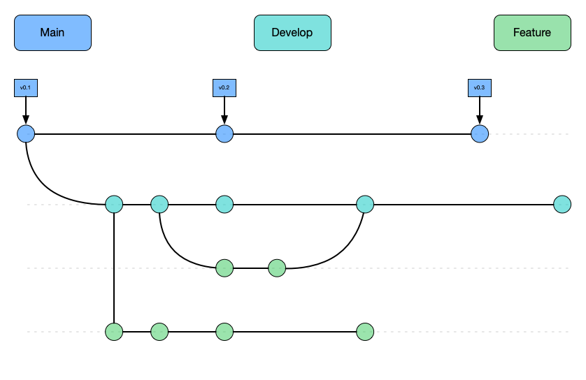
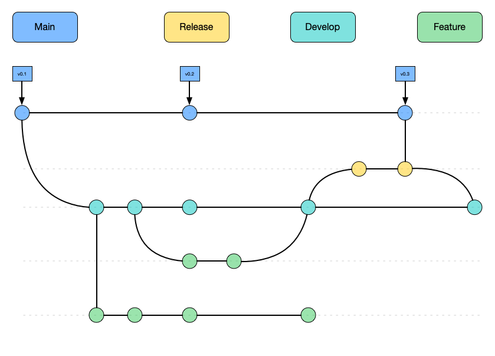
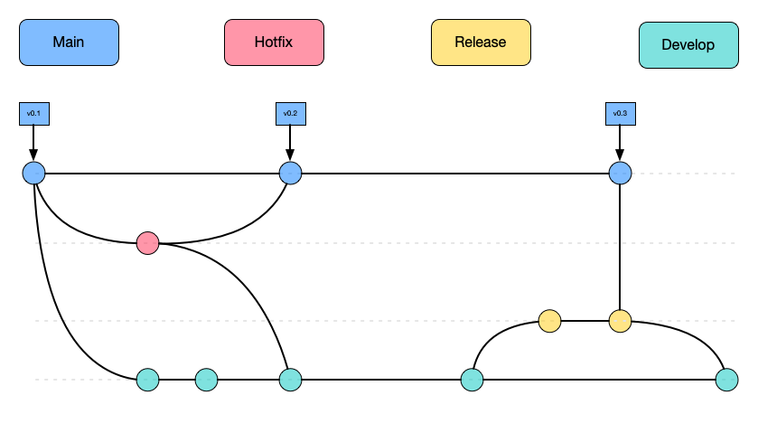

# Gitflow

Gitflow is a git branching model that involves using a set of features, helper and multiple primary branches to develop software. It was introduced by [Vincent Driessen at Nvie](http://nvie.com/posts/a-successful-git-branching-model/).

The main concept is that you have two main long lived branches called `develop` and `main` that are parallel to each other and used other helper branches like `feature`, `hotfix` and `release` branches to merge changes from one to the other.

This parallel branches coincide with their respective development environments.

Gitflow has an [extension](https://github.com/nvie/gitflow) that introduces commands to make it easier to maintain a gitflow workflow.

## Main

Is a long lived branch that stores the official release history of the repository, this branch is used in the production environment and is the most stable of the branches.

It's convenient to tag all the commits that belongs to the `main` branch with a version number

> Never commit directly to the `main` branch

## Develop

This branch is were all the development work is performed, is the [WIP](https://www.investopedia.com/terms/w/workinprogress.asp) for the project, it servers as the integration branch for the features.

This branch has all the history of the project which differentiates from the `main` branch that only contains the releases.

## Feature branches

When you are developing, each new feature should reside in its own branch, which you can publish to a remote repository for collaboration.

This branch does not branch off from `main`, but instead, it branches off from `develop` as their parent branch and once the feature is completed it gets merged back into develop.

> Feature branches **NEVER** interact with `main`

## Release branches

Once that `develop` reach a stage that has enough feature that justifies a release, or the release date reaches, you need to merge these changes to `main`.

To do this you need to create a branch to start the release cycle, this is `Release branches`, at this point in time no new features are going to be introduced, you focus mostly on bug fixes, documentation, or any other task that are related to the release.

> These branches could be attached to a staging environment for further manual testing or QA

Once the release branch is ready to ship it gets merged to `main` and tagged with a version number. It also needs to be merged back to `develop` because some progress could be made since the release was initiated.

Working in this way provides flexibility for the team because the rest of the team could start working on the feature for the next release while the current release is being worked on.

## Hotfix branches

When you have a bug or issue in the production system and you need to be able to patch you, you create branches to fix these issues, these branches are `Hotfix branches.

They are a lot like [Release Branches](#release-branches) but instead of branching off from `develop` this one branch off from `main`.

> This is the only kind of branch that should branch off directly from `main`

As soon as the bug or issue is fixed it should be merged back to `main` and `develop` and `main` should also be tagged to update the version number.

You can think of this branch as `ad hoc` release that works directly on `main`
