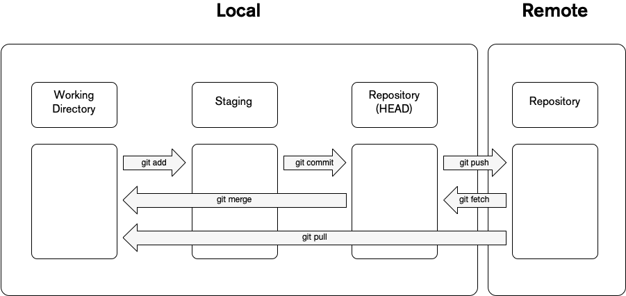

# Git Workflow

When you are working with git you are working with four fundamental elements: Working Directory, Staging Area, Local Repository and Remote Repository.

You can modify, alter or group changes and files with different command that are related to the different stages.

## Working Directory

When you are working on a git project, in the root of the project you have a hidden directory called `.git` which stores the metadata of all the changes that were perform to that particular repository and also contains the data of the current state of the files.

> Database of changes. It contains all the edits and historical versions (snapshots) of the project.[^1]

When you have a file in your working directory if could have three possible states:

- **Staged**: This means that the files with updated changes are marked to be committed to your local repository but are not yet committed.
- **Modified**: This means that the files that have updated changes are not yet stored in the local repository.
- **Committed**: This means that the changes that were made are store safely in the local repository.

If you need to move a file to the `Staging Area` you need to perform a `git add` to the files that you which to add.

## Staging Area

This is the middle ground between what you have done to your file, [Working Directory](#working-directory), and the last thing you have committed, [HEAD commit](https://initialcommit.com/blog/what-is-git-head).

This lets you prepare what would be the next [commit](https://www.atlassian.com/git/tutorials/saving-changes/git-commit) and also give you the tools to easily know what is going on.

> Commits can be thought of as snapshots or milestones along the timeline of a Git project.[^2]

This tooling adds more complexity but it also adds flexibility to craft better commits, since you can modify and stage several times before you create a commit.

## Local Repository

Once you finish adding and modifying the files in the staging area you create a commit, which is like a save point in a video game.

The local repository stores this changes in the `.git` directory, which stores all the checkpoints and commits.

A commit simply implies that you want to take a checkpoint of all the changes that have occurred up to this point since the last commit (HEAD commit) as comparison, once you commit the staging area will be empty.

## Remote Repository

All the previous stages are enough if you want to keep track of those changes only to you and your machine, but software is created in conjunction with other people and for that we need a place that everyone has access that would enable developers to collaborate, this is where a Remote Repository comes in.

Remember that git is a **distributed** version-control system, so you can have a git repository locally and you can synchronize it another git repository that is in a remote location, this particular location is called `origin`.

You could have a local repository that targets multiple origin, this is where the distributed nature of git comes into play.

When you have a group a commits in your local repository and would like to _publish_ those changes to a remote repository you perform a `git push`.

_Since the remote repository can be access by other people, how do I get the changes that were perform by other people on my team?_

When you need to synchronised the remote repository to your local repository you perform a `git pull` to get those changes and add them to your git history.
