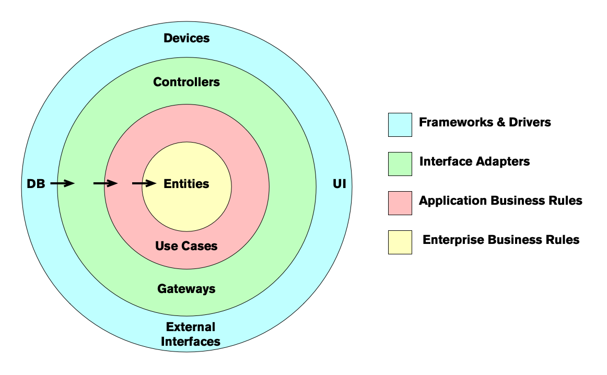

# Regla de dependencia

Cuando está desarrollando un software utilizando la arquitectura limpia, tiene diferentes niveles de abstracción, utilizando el diagrama, cuanto más avance, mayor será el nivel de abstracción. Y los círculos internos son las políticas del programa.

> Las dependencias del código fuente deben apuntar solo hacia adentro, hacia políticas de nivel superior [^1]

Básicamente, esto nos dice que los círculos externos son solo detalles de implementación del programa, el programa en sí no debe basarse en esos círculos sino en abstracciones que representan esos círculos, el núcleo del programa está en los círculos internos, que son la lógica comercial.

Dado que este círculo interno es la representación de las reglas comerciales, es menos probable que esto requiera cambios que los conviertan en los módulos más estables de la arquitectura.

## Entities

Las entidades son objetos en nuestro programa que incorporan un pequeño conjunto de reglas críticas para operar datos comerciales críticos o tienen una manera fácil de acceder a esos datos.

Por ejemplo, en una aplicación bancaria, una entidad podría ser una 'Transacción', una 'Cuenta', un 'Préstamo', en una aplicación de red social podría ser una 'Publicación', un 'Artículo', una 'Historia'.

Estos objetos son conceptos que se usan a diario para los usuarios del programa, lo que obliga al desarrollador a centrarse más en el dominio en el que se ejecutará este programa en lugar de una implementación ad-hoc general de un problema computacional.

## Interactors

Los interactuadores son otra forma de llamar a los _casos de uso_, y los casos de uso contienen las reglas que especifican cómo y cuándo se aplican algunas reglas comerciales críticas cuando se invocan las entidades. _Casos de uso_ controlan la interacción entre entidades.

Por ejemplo, si estamos creando un software de cajero automático, tenemos el caso de uso `Retirar dinero` y para esta operación requerimos diferentes [Entidades](#entities) como `Cuenta`, `Transacciones`, `Usuario`.

El objeto 'Cuenta' tiene una propiedad como 'saldo' y con esta información el _Caso de uso_ puede decidir si ese 'Usuario' en particular puede 'Retirar dinero' de esa cuenta y, si es posible, reduciría esa cantidad del `Cuenta`.

## Interface Adapters

El código que vive en la capa del adaptador de interfaz es un conjunto de adaptadores que convierten datos del formato más conveniente para los casos de uso y las entidades, al formato más conveniente para algún agente externo como una base de datos o la web.

Por ejemplo, si estamos trabajando en una GUI para una aplicación de Android, el modelo `MVC`, `Presenter`, `View` y `Controllers` pertenecen a esta capa.

De la misma forma que para la base de datos transformamos las entidades en una forma más conveniente de ser almacenadas en la capa de datos persistentes, esto significa que si estamos usando SQL, [MongoDB](https://www.mongodb.com), [Redis ](https://redis.io), [RethinkDB](https://rethinkdb.com) o archivos sin formato, estos deben estar restringidos a esta capa y no deben existir ni en las [Entidades](#entities) o [Casos de uso](#interactors).

## Frameworks and Drivers

Esta es la capa más externa del diagrama y está compuesta por marcos y herramientas, como bases de datos o marcos web. Por lo general, escribe un código de pegamento para interactuar con esos servicios.

Cada tecnología que se utiliza además del programa en sí se considera un detalle.

[^1]: Robert C. Martin, 'The Clean Architecture Dependency Rule', _InformIT_, https://www.informit.com/articles/article.aspx?p=2832399
