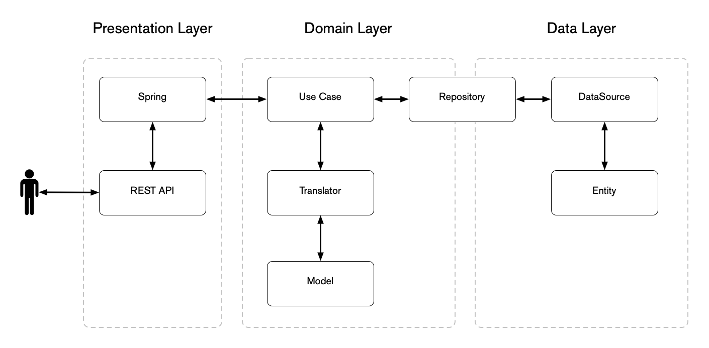

# Implementación

La arquitectura limpia es solo una forma de pensar en nuestro código de manera abstracta haciendo una separación de preocupaciones con la lógica comercial en lugar de prescribir soluciones que dicta un marco o herramienta en particular.

Una forma de implementar la arquitectura limpia sería como una arquitectura de capa horizontal tradicional, donde separamos nuestra base de código en lo que hace desde una perspectiva técnica.

## Presentation

En esta capa de la arquitectura nos enfocamos en la entrada y salida del programa, esta es la capa en la que interactúa el usuario.

- **API REST**: el código relacionado con la solicitud y respuesta HTTP/s, encabezados, validación de entrada.
- **CLI**: Código relacionado con la interpretación de comandos, banderas y valores
- **GUI**: eventos de entrada, botones, colores, diseño.

Si el usuario interactúa con él, pertenece a esta capa independientemente de la implementación real, con esta separación de preocupaciones es posible proporcionar todas estas entradas en el mismo proyecto sin cambiar el resto de nuestro código.

Hay un límite claro en la capa de presentación, solo habla directamente con la [Capa de dominio](#domain) y nunca habla directamente con la [Capa de datos] (#data).

## Domain

En esta capa vive el corazón y el alma de nuestra aplicación, aquí es donde residen las entidades y la lógica de negocios del programa, esta capa debería ser la más estable de las tres capas.

En la capa de dominio, los 'Interactores' se basan en abstracciones de la [Capa de datos](#data) en lugar de una implementación específica, además, la capa de Dominio desconoce la existencia de la [Capa de presentación](#presentation).

La capa de dominio es una dependencia de la capa de presentación, la razón de esto es que la capa de dominio describe lo que debe hacer la aplicación, cómo se logra esto no debe afectar al programa.

Si estamos creando una aplicación bancaria, la lógica siempre es la misma, independientemente de si esta aplicación será una aplicación móvil, una integración a un cajero automático o una herramienta de desarrollo envuelta en una CLI.

## Data

Esta capa maneja todo lo relacionado con el almacenamiento persistente, la comunicación externa o cualquier [Efecto secundario](https://en.wikipedia.org/wiki/Side_effect_(computer_science)).

Una buena regla general es que si necesita algo que esté fuera de la memoria o que requiera almacenamiento persistente, pertenece a esta capa, incluso el sistema de archivos del programa, bases de datos, [ORM] (https://www.freecodecamp.org/news /qué-es-un-orm-el-significado-de-objeto-relacional-mapping-database-tools/), [Colas de mensajes](https://aws.amazon.com/message-queue/), [API](https://backendless.com/what-is-api-as-a-service/), otros programas que usan [Comunicación IPC](https://www.geeksforgeeks.org/inter-process-communication-ipc/ )
