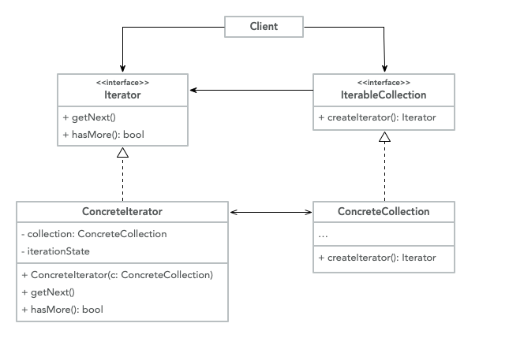
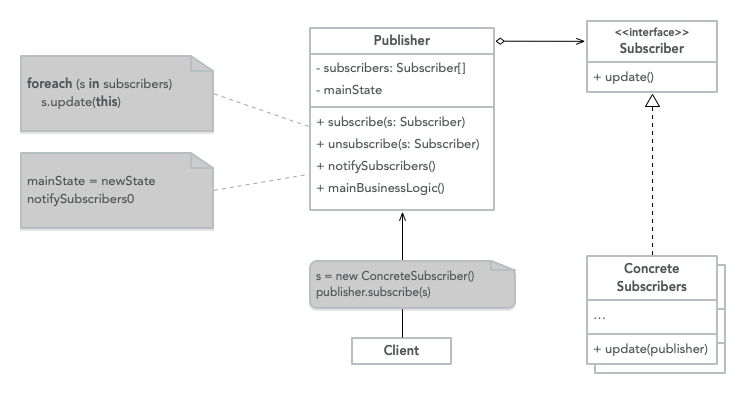

# Patrones de Comportamiento

> Los patrones de comportamiento están relacionados con los algoritmos y la asignación de
> responsabilidades entre objetos.

## Iterator

Es un patrón de comportamiento que te permite recorrer elementos de una colección.
sin exponer la representación subyacente.

**Explicación**

Cuando estamos trabajando con objetos que están relacionados entre sí, estos son expresos.
en términos de un
[Colección](https://en.wikipedia.org/wiki/Collection_(abstract_data_type)),
pero esto es genérico por defecto, iterar sobre una colección es bastante fácil si
tiene la forma de una lista, pero ¿qué tal una estructura más compleja como un árbol,
necesitamos definir una forma de navegar o atravesar esta estructura.

Necesitaríamos acoplar el recorrido dentro de la estructura de datos y crear
implementación diferente para cada uno, pero la razón principal de la colección es
un almacenamiento de los datos, para arreglar esto desacoplamos el recorrido de los datos
estructura en un iterador.

Podríamos tener un [Búsqueda en profundidad](https://www.geeksforgeeks.org/depth-first-search-or-dfs-for-a-graph/) o un [Búsqueda en anchura](https://www.geeksforgeeks.org/breadth-first-search-or-bfs-for-a-graph/) que maneja
diferentes tipos de recorrido, pero los datos subyacentes
estructura, el [Árbol](https://www.javatpoint.com/tree), sigue siendo el mismo.

**Estructura**



- **Iterator**: Esta interfaz declara las operaciones (buscar el siguiente elemento,
   obtener la posición actual, reiniciar la iteración, etc.) que se requieren para atravesar
   Una colección.
- **Concrete Iterators**: Implementa el algoritmo específico para atravesar
   la colección.
- **Collection**: Esta interfaz declara uno o varios métodos para obtener
   iteradores compatibles con la colección.
- **Concrete Collections**: Devolver nuevas instancias de un iterador en particular
   clase cada vez que el cliente solicita una.
- **Client**: Trabaja con las colecciones y los iteradores a través de sus interfaces.

**Código**

```java
public class SQLRows<Type> implements Iterable<Type> {

	private Type[] arrayList;
	private int currentSize;

	public SQLRows(Type[] newArray) {
		this.arrayList = newArray;
		this.currentSize = arrayList.length;
	}

	@Override
	public Iterator<Type> iterator() {
		return new Iterator<Type>() {
			private int currentIndex = 0;

			@Override
			public boolean hasNext() {
				return currentIndex < currentSize
					&& arrayList[currentIndex] != null;
			}

			@Override
			public Type next() {
				return arrayList[currentIndex++];
			}

			@Override
			public void remove() {
				throw new UnsupportedOperationException();
			}
		};
	}
}
```

**Cuándo usar**

- Cuando tiene una estructura de datos compleja pero desea ocultar la complejidad
   de los clientes
- Reducir la duplicación de código transversal en la aplicación
- Cuando necesite su código para atravesar diferentes estructuras de datos o si
   no conoce la estructura de antemano

## Observer

> Define un mecanismo de suscripción para notificar a múltiples objetos que los eventos son
> pasando al objeto que están observando.

**Explicación**

Este patrón es una implementación del
[Patrón de publicación-suscripción](https://ably.com/topic/pub-sub) a nivel de código,
cuando tiene un objeto que quiere ser notificado (suscriptor) cuando otro
objeto cambia su estado (editor), el primer objeto crea una suscripción
que el segundo objeto notificará cuando ocurra un cambio en particular.

La razón de esto es evitar preguntarle al objeto de destino todo el tiempo si su
estado ha cambiado, podemos invertir la lógica y dejar que el objeto de destino notifique
todos los objetos que están interesados en su estado, cuando ocurrieron estos cambios,
y cuál es el nuevo estado.

El _objeto de destino_ se llama `Publisher` y el objeto interesante es
el `Subscriber`, puede tener múltiples `Subscribers` siguiendo un solo
`Publisher`. El editor realiza un seguimiento de todos los `Subscribers` y les permite
saber cuándo cambia un estado, los `Subscribers` también pueden solicitar ser eliminados de
la lista `Subscriber`.

Una implementación de la vida real para esto sería una
[Boletín informativo por correo electrónico](https://www.campaignmonitor.com/resources/knowledge-base/what-is-an-email-newsletter/), en esta analogía
los usuarios son los `Subscribers` y el Newsletter sería el `Publisher`,
como usuarios solicitamos ser agregados a la Newsletter y al mismo tiempo,
puede solicitar darse de baja de esa Newsletter cuando ya no tengamos
cualquier interesado en ellos.

**Estructura**



- **Publisher**: Crea eventos que son interesantes para los otros objetos,
   esto sucede cuando ocurre un evento o cuando el objeto realiza algún comportamiento.
   Contienen una infraestructura de suscripción que permite a los nuevos suscriptores unirse y
   los suscriptores actuales abandonan la lista
- **Subscriber**: Interfaz que declara la interfaz de notificación. Normalmente
   consiste en un método que tiene varios parámetros que permiten al editor pasar
   algunos eventos junto con la actualización.

> Cuando ocurre un nuevo evento, el `Publisher` revisa la lista de
> `Subscribers` y llama al método de notificación en la interfaz de suscriptor
> para hacerles saber que ocurrió un cambio

**Código**

```java
class Client {
	public static void main(String[] args) {
		Publisher publisher = new Publisher();
		EventSubscriber subscriber = new EventSubscriber();
		publisher.subscribe(subscriber);
	}
}

class Publisher {
	private Collection<Subscriber> subscribers;
	State state;

	Publisher() {
		this.subscribers = new HashSet<>();
	}

	void subscribe(Subscriber subscriber) {
		this.subscribers.add(subscriber)
	}

	void unsubscribe(Subscriber subscriber) {
		this.subscribers.remove(subscriber);
	}

	void notifySubscribers() {
		while (subscribers.hasNext()) {
			Subscriber subscriber = subscribers.next();
			subscriber.update(this)
		}
	}

	mainBusinessLogic() {
		// Something happens that changes the state
	}
}

class EventSubscriber implements Subscriber {
	update(Publisher publisher) {
		// I react to the state
		State state = publisher.state;
	}
}

interface Subscriber {
	update(Publisher publisher)
}

class State {}
```

**Cuándo usar**

- Cuando necesita que un objeto cambie cuando cambia el estado de otro objeto
- Cuando necesite observar algunos objetos por un tiempo limitado o casos específicos
