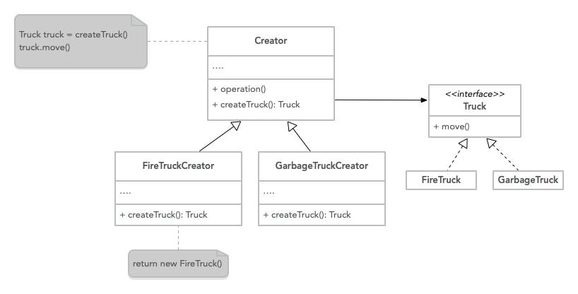
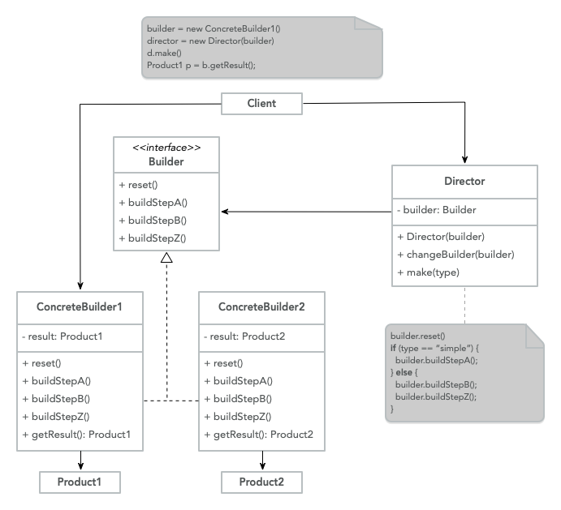

# Patrones Creacionales

Los patrones de diseño creativo son patrones que proporcionan la creación de múltiples objetos.
mecanismos, logran esto abstrayendo el proceso de creación de instancias.

Esto permite que los sistemas sean flexibles e independientes sobre cómo los objetos son
creadas, compuestas o representadas, adquieren importancia en la evolución de un sistema
donde los sistemas se basan más en la composición de objetos que en la herencia, porque
el enfoque deja de depender de un comportamiento de reparación de código duro, en lugar de eso, se enfoca
sobre el comportamiento fundamental que se puede componer para crear
uno más complejo. [^1]

## Factory Method

> Proporciona una interfaz para crear un objeto en un
> superclase, pero habilite las subclases para modificar el tipo de objetos que
> ser creado.

Separa el proceso de creación de un objeto del código que depende
en la interfaz del objeto. [^2]

**Explicación**

Cuando una aplicación requiere que usted se comporte de una manera particular para realizar
una tarea, la implementación concreta es identificada por algún parámetro.

En lugar de usar condicionales para determinar el tipo concreto específico,
delegar esa decisión a un componente separado que crea dicho objeto (`Factory`).

El uso del patrón agrega flexibilidad y escalabilidad al código porque
fácilmente permite agregar comportamientos más concretos a lo largo del tiempo sin la
necesita cambiar el código, conforme con OCP.

**Estructura**



- **Truck**: Es la interfaz que es común a todos los objetos que están
   generado por el 'Creador' y sus subclases
- **Concrete truck**: Es la implementación específica de la interfaz
- **Creator**: Es el punto de entrada para el método de fábrica y devuelve
   un objeto `Truck`, esto es solo una abstracción de la creación real
   no sucede en esta clase, esto podría tratarse como una clase base
   para un comportamiento predeterminado o una clase abstracta para forzar el
   `Concrete Creators` para implementar la lógica.
- **Concrete Creators**: Anular el método de fábrica para devolver un diferente
   tipo de `Truck`.

**Código**

```java
class Client {
  private Creator creator;
  private Truck truck;
  public static void main(String[] args) {
	  String truckType = args[0];
	  if(truckType === "fire") {
		  this.creator = new FireTruckCreator();
	  } else {
		  this.creator = new GarbageTruckCreator();
	  }
	  this.truck = this.creator.createTruck();
	  this.truck.move();
  }
}

class Creator {
  public abstract Truck createTruck();
  public void operation() {}
}

interface Truck {
  public void move();
}

class FireTruck implements Truck {
  public void move() {}
}

class GarbageTruck implements Truck {
  public void move() {}
}

class FireTruckCreator extends Creator {
  public Truck createTruck() {
	return new FireTruck()
  }
}

class GarbageTruckCreator extends Creator {
  public Truck createTruck() {
	  return new FireTruck()
  }
}
```

**Cuándo usar**

- Cuando no sabe de antemano cuántos tipos o dependencias tiene su código
   depender de.
- Cuando desee proporcionar a los usuarios de su biblioteca o marco una forma de
   extender sus componentes internos.
- Cuando necesite ahorrar recursos del sistema reutilizando objetos en lugar de
   reconstruirlos cada vez.

## Builder

> Construye objetos complejos paso a paso.

Te permite crear diferentes tipos y representaciones de un objeto.
utilizando el mismo código de construcción.

**Explicación**

Cuando está construyendo un objeto que podría tener diferentes parámetros y
permutaciones que potencialmente podría crear subclases para especificar el comportamiento
y la estructura de un objeto, pero esto sería más difícil de mantener.

Otro enfoque sería usar un constructor gigante en la clase base con
todos los parámetros posibles para controlar el objeto, el problema con esto, es
que termina haciendo muchas refactorizaciones una vez que se obtiene un nuevo requisito
introducido, y también hace que la llamada del constructor sea bastante fea ya que en la mayoría
casos la mayoría de los parámetros no se utilizan.

> Un constructor simple tiene un número muy pequeño de parámetros, y todos
> los parámetros son primitivos o enumeraciones. Tales constructores simples aumentan
> usabilidad. [^3]

Los patrones `Builder` sugieren que necesitamos extraer la construcción del objeto
del código fuera de su propia clase y moverlo a objetos separados
llamados `constructores`.

Este constructor proporciona un conjunto de funciones que le permite especificar el
valores que son requeridos por el objeto final y tiene una función llamada
`build` que inicia el proceso de construcción y devuelve el objeto requerido.

Puede encontrar un ejemplo del patrón `Builder` en Java `Calendar` Object.

```java
Calendar cal = new Calendar.Builder()
				   .setCalendarType("japanese")
				   .setFields(YEAR, 1, DAY_OF_YEAR, 1)
				   .build();
```

**Código**

```java
class Client {
	public static void main(String[] args) {
		ConcreteBuilder1 builder = new ConcreteBuilder1();

		Director director = new Director(builder);
		director.make();

		Product1 product = builder.getResult();

		// Change builder to create a different product
		ConcreteBuilder2 builder2 = new ConcreteBuilder2();
		director.changeBuilder(builder2)
		director.make()

		Product2 product2 = builder2.getResult();
	}
}

class Director {
	private Builder builder;
	public void Director(Builder builder) {
		this.builder = builder;
	}

	public void changeBuilder(Builder builder) {
		this.builder = builder;
	}

	public void make() {
		this.builder.reset();
		String type = this.builder.getType();
		if(type == "simple") {
			this.builder.buildStepA();
		} else {
			this.builder.buildStepB();
			this.builder.buildStepZ();
		}
	}
}

interface Builder {
	String getType();
	void reset();
	void buildStepA()
	void buildStepB()
	void buildStepZ()
}

class ConcreteBuilder1 implements Builder {
	private Product1 result;
	public String getType() {
		return "simple";
	}
	public void buildStepA() {}
	public void buildStepB() {}
	public void buildStepZ() {}
	public Product1 getResult() {
		return this.result;
	}
}

class ConcreteBuilder2 implements Builder {
	private Product2 result;
	public String getType() {
		return "complex";
	}
	public void buildStepA() {}
	public void buildStepB() {}
	public void buildStepZ() {}
	public Product2 getResult() {
		return this.result;
	}
}

class Product1 {}
class Product2 {}
```

**Estructura**



- **Builder**: Es una interfaz que declara todos los pasos disponibles que
   son comunes a todos los diferentes tipos de constructores.
- **Concrete Builders**: Proporciona una implementación de construcción diferente.
   pasos.
- **Products**: Estos son los objetos de resultado final que son producidos por
   diferentes constructores.
- **Director**: Es el coordinador de los constructores, da el orden.
   de los pasos de construcción y puede crear y reutilizar configuraciones específicas
   de productos.
- **Client**: Debe asociar un objeto constructor con un director, normalmente
   hecho una vez a través del constructor del director, pero dependiendo del caso de uso,
   podría tener múltiples constructores para diferentes pasos o estructuras de datos complejas.

**Cuándo usar**

- Necesita muchos parámetros o pasos para crear un objeto.
- Quiere crear una representación diferente de algún objeto.
- Cuando necesite construir un [Árbol compuesto](https://refactoring.guru/design-patterns/composite) u otras estructuras de datos complejas.

[^1]:
    'Creational Patterns', _The University of North Carolina at Chapel
    Hill_, https://www.cs.unc.edu/~stotts/GOF/hires/chap3fso.htm

[^2]:
    Isaac Rodriguez, 'The Factory Method Pattern and Its Implementation
    in Python', _Real Python_, https://realpython.com/factory-method-python/

[^3]:
    'Constructor Design', _Microsoft_, September 9, 2021,
    https://learn.microsoft.com/en-us/dotnet/standard/design-guidelines/constructor
