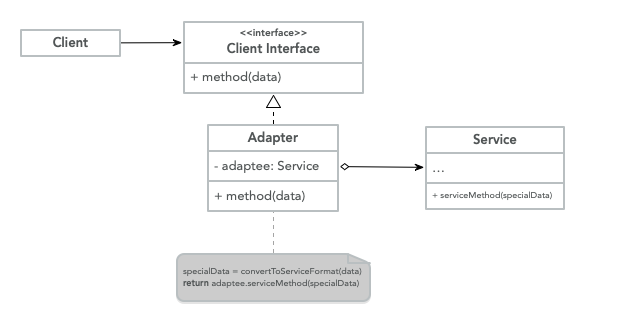
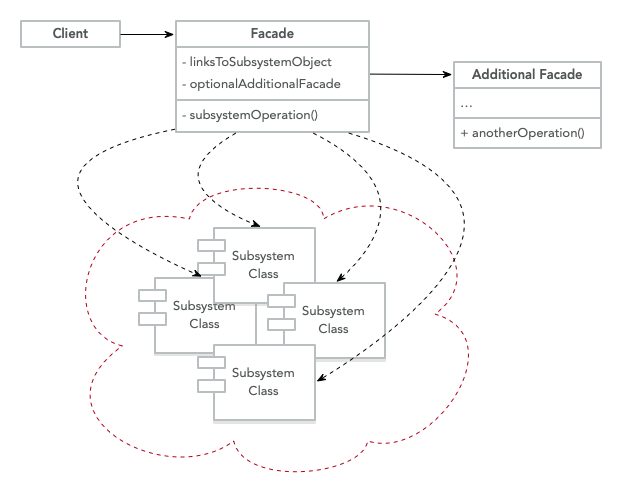

# Patrones Estructurales

Este tipo de patrones explica cómo podemos ensamblar objetos y clases en
estructuras más grandes, manteniendo estas estructuras flexibles y eficientes.

## Adapter

> Es un patrón de diseño estructural que permite objetos con incompatible
> interfaces para colaborar.

**Explicación**

A veces tenemos tipos de datos que son incompatibles entre sí, por
ejemplo, podríamos hacer que los usuarios compraran la actividad como archivos `XML`, encontramos un
servicio de terceros que es capaz de darnos un modelo de recomendación para el
usuarios, pero este servicio utiliza el formato `JSON` como datos de entrada.

Usamos el patrón de adaptador para crear una interfaz que traduce el contenido
desde objetos `XML` a `JSON` que luego pueden ser utilizados por el
motor de recomendación.

Además de transformar desde diferentes formatos de datos, también podemos usarlo para crear
objetos con diferentes interfaces para colaborar.

**Estructura**



- **Client**: Esta es una clase que contiene la lógica de negocios del programa.
- **Client Interface**: Describe el protocolo que las otras clases necesitan para
   siga para interactuar con el código del cliente.
- **Service**: Esta es la clase que requiere que los datos sean transformados,
   el `Client` puede usar el servicio directamente debido a la compatibilidad.
- **Adapter**: Es la clase que puede trabajar tanto con el cliente como con el servicio,
   e implementa la `Client Interface` mientras envuelve el objeto de servicio. los
   adaptador recibe llamadas del cliente a través de la interfaz del adaptador y traduce
   esas solicitudes al servicio en un formato que pueda entender.

**Código**

```java
class Client {
	public static void main(String[] args) {
		String xmlFilePath = args[0];
		XML data = magicMethod(xmlFilePath);

		DataAdapter adapter = new DataAdapter();
		JSON json = adapter.transform(data);

		JsonService.serviceMethod(json)
	}
}

class DataAdapter implements DataTransformation {
	public JSON transform(XML xml) {
		JSON json = new JSON();
		// Magic happens
		json.data = xml.data;
		return json;
	}
}

interface DataTransformation {
	JSON transform(XML xml)
}

class XML {}

class JsonService {
	public static void serviceMethod(JSON json)
}

class JSON {}
```

**Cuándo usar**

- Cuando tienes una clase existente pero esta clase no es compatible con el
   resto del código base.
- Cuando desee reutilizar subclases existentes que carecen de funcionalidad común
   que se puede abstraer en una superclase.

## Façade

> Es un patrón de diseño estructural que simplifica la interfaz a una biblioteca,
> un marco, o cualquier conjunto complejo de clases.

**Explicación**

Cuando necesitamos confiar en marcos o bibliotecas específicas, debemos
inicializar, configurar y realizar un seguimiento de las dependencias y ejecutar el método
en el orden correcto.

Al final, la lógica de la aplicación se acopla estrechamente con la
implementación de esta biblioteca de terceros, lo que dificulta el mantenimiento
y comprender, para evitar esto creamos una interfaz simple que proporciona la
funcionalidad que realmente nos importaba en lugar de preocuparnos por la
implementación subyacente.

Esto limita las funcionalidades proporcionadas por la biblioteca, pero mejora la
funcionalidad que nuestro negocio realmente requería y también desacopla la
programa de esa biblioteca.

**Estructura**


- **Client**: Utiliza `Façades` en lugar de llamar a los objetos de los subsistemas
   directamente.
- **Façade**: Proporciona un acceso conveniente a una parte particular del
   funcionalidad del subsistema.
- **Additional Façade**: Estas fachadas también se pueden crear para evitar
   contaminar una sola fachada con una característica no relacionada que la haría
   otra estructura compleja, esta fachada puede ser utilizada por el cliente o
   otra fachada.
- **Complex Subsystem**: Podrían ser varios objetos que interactúan en
   formas complejas, bibliotecas de terceros, marcos, ORM. Estos subsistemas son
   desconocía la existencia de las 'Fachadas'.

**Código**

```java
class Client {
	public static void main(String[] args) {
		Coordinate from = getCurrentLocation();
		Coordinate to = getFavoriteLocation("home");

		MapService service = new MapService();

		Direction[] directions = service.getRoute(from, to);
		Event[] events = service.getEvents(directions);

		// Read out loud directions
		speak(directions)

		// Read out loud any events in the route
		speak(events)
	}
}

class Coordinate {
	private Float latitude;
	private Float longitude;
	public void Coordinates(Float latitude, Float longitude) {
		this.latitude = latitude;
		this.longitude = longitude
	}
}

class MapService  {
	private GoogleMap googleMapService;
	private Waze wazeService;
	public void MapService() {
		this.googleMapService = new GoogleMap();
		this.wazeService = new Waze();
	}
	public Direction[] getRoute(Coordinate from, Coordinate to) {
		this.googleMapService.getRoute(from, to);
	}
	public Event[] getEvents(Direction[] directions) {
		return this.wazeService.getEvents(directions);
	}
}

class GoogleMap {
	public Direction[] getRoute(Coordinate from, Coordinate to) {}
}

class Waze {
	public Event[] getEvents(Direction[] directions) {}
}

class Direction {}
class Event {}
```

**Cuándo usar**

- Cuando necesita una interfaz simple para interactuar con un subsistema complejo.
- Cuando se quiere estructurar el subsistema en capas.
- Cuando desee desacoplar una biblioteca o un marco de la lógica empresarial.
