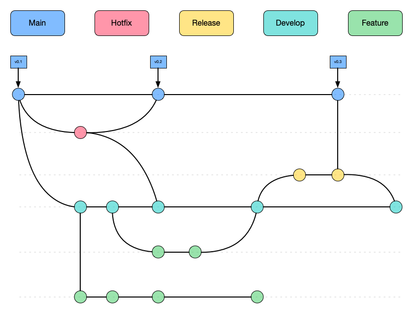
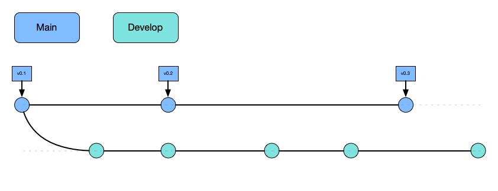
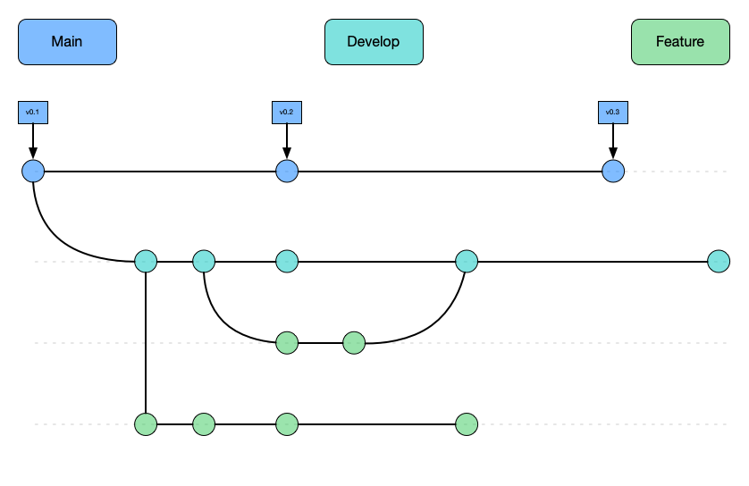
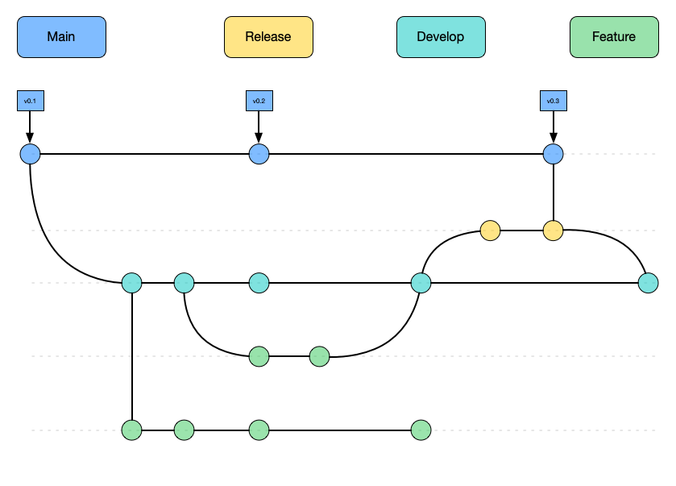

# Gitflow

Gitflow es un modelo de bifurcación de git que implica el uso de un conjunto de funciones, auxiliares y múltiples ramas primarias para desarrollar software. Fue presentado por [Vincent Driessen en Nvie](http://nvie.com/posts/a-successful-git-branching-model/).

El concepto principal es que tiene dos ramas principales de larga duración llamadas `develop` y `main` que son paralelas entre sí y usan otras ramas auxiliares como `feature`, `hotfix` y `release` para fusionar cambios de uno a el otro.

Estas ramas paralelas coinciden con sus respectivos entornos de desarrollo.

Gitflow tiene una [extensión](https://github.com/nvie/gitflow) que introduce comandos para facilitar el mantenimiento de un flujo de trabajo de gitflow.

## Main

Es una rama de larga duración que almacena el historial oficial de versiones del repositorio, esta rama se utiliza en el entorno de producción y es la más estable de las ramas.

Es conveniente etiquetar todos los commits que pertenecen a la rama `main` con un número de versión

> Nunca te comprometas directamente con la rama `main`

## Develop

Esta rama es donde se realiza todo el trabajo de desarrollo, es el [WIP](https://www.investopedia.com/terms/w/workinprogress.asp) para el proyecto, sirve como rama de integración para las funciones.

Esta rama tiene toda la historia del proyecto que se diferencia de la rama "principal" que solo contiene los lanzamientos.

## Feature branches

Cuando esté desarrollando, cada característica nueva debe residir en su propia rama, que puede publicar en un repositorio remoto para la colaboración.

Esta rama no se ramifica desde "principal", sino que se ramifica desde "desarrollar" como su rama principal y, una vez que se completa la función, se vuelve a fusionar con desarrollar.

> Las ramas de función **NUNCA** interactúan con `principal`

## Release branches

Una vez que 'desarrollar' alcanza una etapa que tiene suficientes funciones que justifican un lanzamiento, o llega la fecha de lanzamiento, debe fusionar estos cambios en 'principal'.

Para hacer esto, debe crear una rama para iniciar el ciclo de lanzamiento, esto es "Ramas de lanzamiento", en este momento no se introducirán nuevas funciones, se enfoca principalmente en la corrección de errores, documentación o cualquier otra tarea que están relacionados con el lanzamiento.

> Estas sucursales podrían adjuntarse a un entorno de prueba para realizar más pruebas manuales o control de calidad

Una vez que la rama de lanzamiento está lista para enviarse, se fusiona con `main` y se etiqueta con un número de versión. También debe volver a fusionarse con "desarrollar" porque se podrían lograr algunos avances desde que se inició el lanzamiento.

Trabajar de esta manera brinda flexibilidad al equipo porque el resto del equipo podría comenzar a trabajar en la función para la próxima versión mientras se trabaja en la versión actual.

## Hotfix branches

Cuando tiene un error o problema en el sistema de producción y necesita poder parchearlo, crea ramas para solucionar estos problemas, estas ramas son "ramas de revisión".

Son muy parecidos a [Release Branches](#release-branches) pero en lugar de bifurcarse desde `develop`, este se bifurca desde `main`.

> Este es el único tipo de rama que debe bifurcarse directamente desde `principal`

Tan pronto como se solucione el error o el problema, debe volver a fusionarse con `main` y `develop` y `main` también deben etiquetarse para actualizar el número de versión.

Puede pensar en esta rama como una versión 'ad hoc' que funciona directamente en `main`
