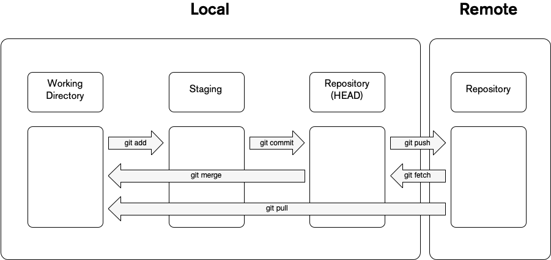

# Flujo de trabajo de Git

Cuando trabaja con git, trabaja con cuatro elementos fundamentales: directorio de trabajo, área de preparación, repositorio local y repositorio remoto.

Puede modificar, alterar o agrupar cambios y archivos con diferentes comandos que están relacionados con las diferentes etapas.

## Working Directory

Cuando está trabajando en un proyecto git, en la raíz del proyecto tiene un directorio oculto llamado `.git` que almacena los metadatos de todos los cambios que se realizaron en ese repositorio en particular y también contiene los datos del estado actual de Los archivos.

> Base de datos de cambios. Contiene todas las ediciones y versiones históricas (instantáneas) del proyecto.[^1]

Cuando tiene un archivo en su directorio de trabajo, podría tener tres estados posibles:

- **Staged**: Esto significa que los archivos con cambios actualizados están marcados para ser confirmados en su repositorio local pero aún no están confirmados.
- **Modified**: Esto significa que los archivos que tienen cambios actualizados aún no están almacenados en el repositorio local.
- **Commited**: Esto significa que los cambios realizados se almacenan de forma segura en el repositorio local.

Si necesita mover un archivo al 'Área de preparación', debe realizar un 'git add' a los archivos que desea agregar.

## Staging Area

Este es el término medio entre lo que ha hecho con su archivo, [Directorio de trabajo](# Working Directory), y lo último que ha confirmado, [Commit HEAD](https://initialcommit.com/blog/what-is-git-head).

Esto le permite preparar lo que sería el próximo [commit](https://www.atlassian.com/git/tutorials/saving-changes/git-commit) y también le brinda las herramientas para saber fácilmente qué está pasando.

> Las confirmaciones se pueden considerar como instantáneas o hitos a lo largo de la línea de tiempo de un proyecto de Git.[^2]

Esta herramienta agrega más complejidad pero también agrega flexibilidad para crear mejores compromisos, ya que puede modificar y organizar varias veces antes de crear un compromiso.

## Local Repository

Una vez que termine de agregar y modificar los archivos en el área de preparación, crea una confirmación, que es como un punto de guardado en un videojuego.

El repositorio local almacena estos cambios en el directorio `.git`, que almacena todos los puntos de control y confirmaciones.

Una confirmación simplemente implica que desea tomar un punto de control de todos los cambios que se han producido hasta este punto desde la última confirmación (confirmación HEAD) como comparación, una vez que confirme, el área de preparación estará vacía.

## Remote Repository

Todas las etapas anteriores son suficientes si desea realizar un seguimiento de esos cambios solo para usted y su máquina, pero el software se crea en conjunto con otras personas y para eso necesitamos un lugar al que todos tengan acceso que permita a los desarrolladores colaborar, este es donde entra en juego un Repositorio Remoto.

Recuerde que git es un sistema de control de versiones **distribuido**, por lo que puede tener un repositorio git localmente y puede sincronizarlo con otro repositorio git que esté en una ubicación remota, esta ubicación en particular se llama `origen`.

Podría tener un repositorio local que apunte a múltiples orígenes, aquí es donde entra en juego la naturaleza distribuida de git.

Cuando tienes un grupo de confirmaciones en tu repositorio local y te gustaría _publicar_ esos cambios en un repositorio remoto, realizas un `git push`.

_Dado que otras personas pueden acceder al repositorio remoto, ¿cómo obtengo los cambios realizados por otras personas de mi equipo?_

Cuando necesite sincronizar el repositorio remoto con su repositorio local, realice un `git pull` para obtener esos cambios y agregarlos a su historial de git.

[^1]: 'Version Control Systems', _Geeks For Geeks_, June 29, 2022, https://www.geeksforgeeks.org/version-control-systems/
[^2]: 'Git commit', _Bitbucket_, 2022, https://www.atlassian.com/git/tutorials/saving-changes/git-commit
